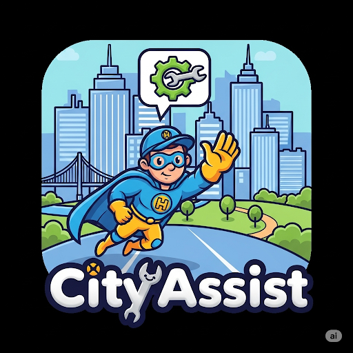

# CivicTrack
Empower citizens to report local issues like road damage, garbage accumulation, or water leaks quickly and easily through a user-friendly platform. Residents can submit reports with photos and locations, ensuring transparency and swift communication with local authorities.

The system enables seamless tracking of each issue’s resolution status, keeping citizens informed and involved. By simplifying engagement, this platform strengthens community participation and helps create cleaner, safer neighborhoods.





## Table of contents

- [📍 Overview](#-overview)
- [👾 Features](#-features)
- [📁 Project Structure](#-project-structure)

- [🚀 Getting Started](#-getting-started)
  - [☑️ Prerequisites](#-prerequisites)
  - [⚙️ Installation](#-installation)

- [🎗 License](#-license)
- [🙌 Acknowledgments](#-acknowledgments)
- [🔰 Contributing](#-contributing)

---


## 📍 Overview

This web application serves as a vital digital tool for urban residents, empowering them to swiftly report damage to public infrastructure by uploading images and providing location details. By enabling individuals to highlight issues such as broken sidewalks, vandalized public spaces, or malfunctioning streetlights, the platform acts as a direct channel between citizens and municipal authorities. Residents can demand prompt repairs, track the status of their reports in real time, and remain informed about ongoing civic projects. This streamlined approach fosters transparency, accountability, and efficient communication within the city. Ultimately, it cultivates a stronger sense of community responsibility and participation, facilitating the creation of cleaner, safer, and more sustainable urban environments


---

## 👾 Features

(1) Quick Issue Reporting
(2) Supported Issue Categorising
(3) Status Tracking
(4) Map Mode & Filtering
(5)Admin Role
(6)Moderation & Safty
---

## 📁 Project Structure


```sh
└── CivicTrack/
    ├── frontend
    │          └── src
    │               ├──App.jsx
    │               ├──App.css
    │               ├──index.css
    │               └── componets
    │               │        └──Issues
    │               │        │      └──IssueCard.jsx
    │               │        │      └── Issue.list.jsx
    │               │        └──layout
    │               │              └──Navbar.jsx
    │               └── contexts
    │               │       └──AuthContext.jsx
    │               └── pages
    │               │        └──AuthPages.css
    │               │        └──HomePage.jsx
    │               │        └──Homepage.css
    │               │        └──IssueDetailPage.css
    │               │        └──IssueDetailPage.jsx
    │               │        └─LoginPage.jsx
    │               │        └──MyIssuesPage
    │               │        └──RegisterPage.css
    │               │        └─RegisterPage.jsx
    │               │        └──ReportIssuePage.jsx
    ├               ├──assests
    │                      ├──unnamed.png
    │
    ├── server
    │      └── config
    │      └── middleware
    │      └── models
    │      └── routes
           └── .env

```
##⚙️ Installation](#-installation)

  ```sh
          npm init
          npm install

  ```  

##🎗-license
    MIT

##🙌-acknowledgments)
    Nathan Joseph
    Rishi Jha
